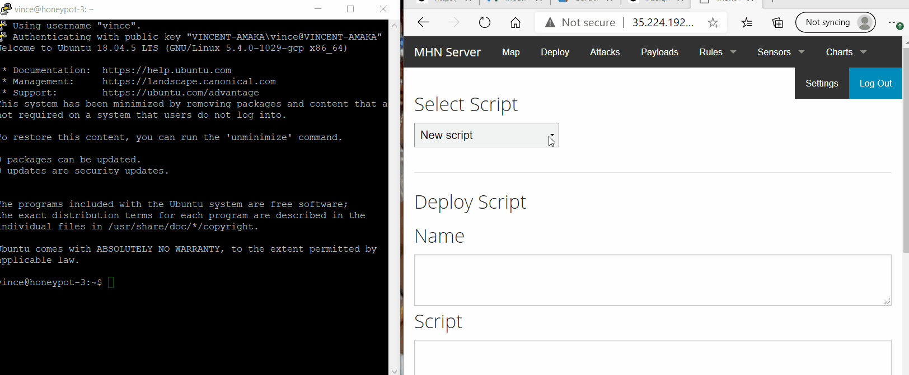
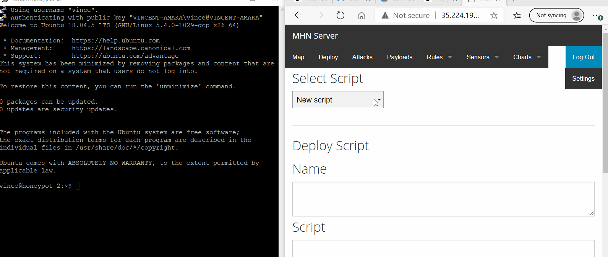

# Honeypot-Assignment

**Time spent:** **8** hours spent in total

**Objective:** Create a honeynet using MHN-Admin. Present your findings as if you were requested to give a brief report of the current state of Internet security. Assume that your audience is a current employer who is questioning why the company should allocate anymore resources to the IT security team.

### MHN-Admin Deployment (Required)

**Summary:** I deployed the MHN-Admin using Google CLoud Platform. I downloaded and installed the GCP SDK. I set up the region and zone as well as the firewall. I created the VM by following the steps on the Codepath Cybersecurity Course.

### Dionaea Honeypot Deployment (Required)

**Summary:** Dionaea is a type of Honeypot used to get information about malwares and malicious atteckers as well as their IP addresses, Geographic regions and Ports.

#### Snort Honeypot

**Summary:** Snort is a honeypot that can easily be used by a security researcher as an intrusion Detection System to monitor network traffic. 

#### Cowrie Honeypot

**Summary:**  Cowrie is a medium to high interaction SSH and Telnet honeypot designed to log brute force attacks and the shell interaction performed by any attacker while observing the attacker's pattern.

